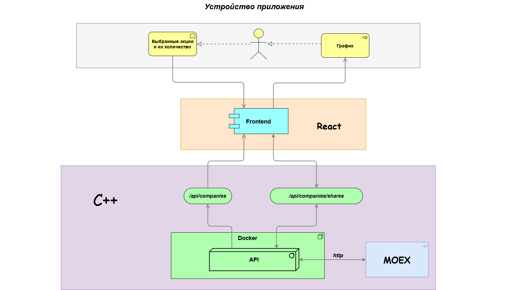

# Архитектура проекта

Проект представляет собой веб-приложение для отслеживания стоимости и анализа инвестиционного портфеля в реальном времени.

## Основные компоненты

### 1. UI (Frontend: React)
- **Описание**: Пользовательский интерфейс, созданный на React. Позволяет пользователю вводить данные о своем портфеле, такие как количество и тип акций.
- **Функции**:
  - Ввод данных о портфеле
  - Отображение стоимости портфеля в реальном времени
  - Визуализация графиков изменений стоимости

### 2. API (Backend: C++)
- **Описание**: API реализовано на C++ и развернуто в Docker-контейнере. Оно предоставляет данные о компаниях и акциях.
- **Эндпоинты**:
  - `/api/companies`: Получение списка доступных компаний.
  - `/api/companies/shares`: Получение информации о выбранных акциях и их стоимости.

### 3. Интеграция с MOEX
- **Описание**: API взаимодействует с Московской биржей (MOEX) для получения актуальных данных о стоимости акций.

## Взаимодействие компонентов

1. **Фронтенд** отправляет запрос к API для получения списка доступных компаний
2. **Пользователь** вводит данные об акциях и их количестве в интерфейсе React
3. **API на C++** принимает запросы, обращается к MOEX для актуализации данных, обрабатывает и возвращает их фронтенду
4. **Фронтенд** отображает полученные данные, включая графики изменения стоимости портфеля

## Развёртывание

- **Docker**: Все компоненты API разворачиваются в Docker-контейнере